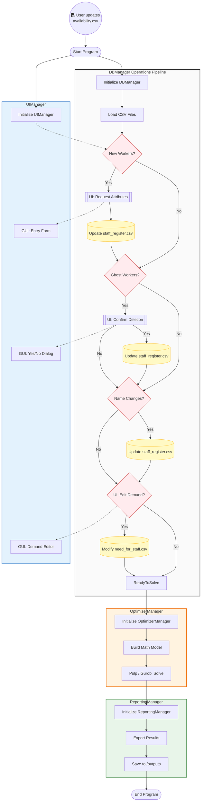

# Optimization-Based Workforce Scheduling System  
## Summary  : 

This project implements a workforce scheduling system formulated as a Binary Integer Programming (BIP) problem. 

The system models staff availability, role requirements, operational constraints and soft penalties to generate an optimal weekly schedule under business (various) constraints needs.

## Mathematical Formulation


## Project Structure 
```
├── config.yaml                # Central configuration file
├── requirements.txt           # Python dependencies
│
├── data/                      # Input CSV files
│   ├── staff_availability.csv # Employee availability data
│   ├── need_for_staff.csv     # Staffing requirements per shift
│   └── staff_register.csv     # Employee master data
│
├── outputs/                   # Generated outputs
│   ├── Weekly_Staff_Schedule.xlsx
│   ├── Weekly_Staff_Schedule.pdf
│   ├── Proposed_Staff_Schedule.xlsx
│   └── Shortage_Report.txt
│
├── logs/
│   └── staff_scheduler.log    # Application logs
│
└── src/
    ├── main.py                # Application entry point
    ├── optimizer_manager.py   # Scheduling optimization logic (BIP/MIP)
    ├── db_manager.py          # Data loading and management
    ├── reporting_manager.py   # Excel/PDF report generation
    ├── ui_manager.py          # User interface logic
    └── utility.py             # Helper functions
```

### data : 

Code is based on 3 data source : 
- staff_availability.csv (change weekly based on new availability based on Google form csv format)
- need_for_staff.csv (template of demand for each shift and each role that can be adapt weekly inside the UI)
- staff_register.csv (information about each worker that can be adapt weekly inside the UI).  

The expected data format is checked using the config file that contains the headers of the csv 

### logs : 

A report of eventual errors, modification of db and various information about the eventual bugs. 

### outputs : 
- Shortage_Report.txt : a simple report with the missing role for each shift.  
- Weekly_Staff_Schedule.xlsx : final excel schedule.
- Weekly_Staff_Schedule.pdf : the schedule format to pdf.

### src : 
General Idea : the choice of the stack can be changed as long as each class implement the same API (function and report type)
- StaffManager : use pandas and apply permanent modification of dfs, reconciliation (change of name, ghost worker, new worker)
- Optimizer : use Pulp and return the optimal assignement
- ReportingManager : collect all the results
- UiManager : use FreeSimpleUI and handle collection of new datas



Few Comments about the current pipeline : 

- **Automation** : As "staff_availibility.csv" is based on template from google forms export csv the whole pipeline can be automate using google api for upload result from the form and launch a new form.
- **GUI** : While operationnal using FreeSimpleGui is not the more convenient for user interface and visualization fo dataframe like staff_register or demand. Typically, an interface based on Html and CSS will be more handy.
- **Feedback loop from user** : What is currently missing is a feedback loops with the user about the proposed solutions handle by the **ReportingManager** class. 

## Running the Project 
```
 1- Create venv with requirements.txt : python -m venv .venv 
 2- Activate : .venv\Scripts\activate 
 3- Populate venv : pip install -r requirements.txt
 4- Running the code : python src/main.py
```

## Making a standalone application 
In order to be used by all type of people, the repo can be make as a standalone application using the following command with pyInstaller : 
```
python -m PyInstaller --noconfirm --onedir --windowed --name "Staff_Scheduler" --collect-all pulp --add-data "config.yaml;." --add-data "data;data" --add-data "outputs;outputs" --add-data "logs;logs" main.py

```

## Future Improvements 
 1 - Other constraints are possibles : incompatibility between two woerkers that cannot be scheduled to the same shift
 
 2 - New type of Optimizer : BIP is not the only possible way to solve the problem in an exact manner (ex: CP). Also, for larger problem with more constraints and/or more ppl excat approach will become untractable thus the implementation of approximate algorithm such as Grasp algorithm will be nice. 
 
 3 - Other objectives are possibles : we can add fairness constraint between the different workers based on various criteria (the worker the more available have priority, the assignement need to minimize the STD between workers etc... )
 
 4 - Testing : while we catch the errors in the logger, the most clean way to do will be to add Unit test
 
 5 - UI : Switch this simple pratical UI to something nicer and more user friendly.
